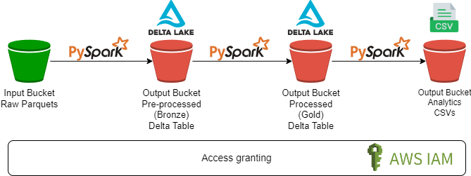

# NYC TLC Trip Data Pipelines

## Local run
Disclaimer: Development was made in Windows

### Environment Setup
To run the pipelines in the repository in local environment:

- Either create a `.env` file or rename the `example.env` to `.env`
- Replace the variable values with your values

| Variable    | Description |
| -------- | ------- |
| SOURCE_S3_BUCKET  | Name of the bucket where the parquet files are |
| DESTINATION_S3_BUCKET | Name of the bucket where the Delta Tables, logs and analytics results will be saved on |
| AWS_ACCESS_KEY_ID    | Your AWS Access Key with the necessary permissions to read from the Source Bucket and Write on the Destination Bucket |
| AWS_SECRET_ACCESS_KEY    | Your AWS Secret Access Key with the necessary permissions to read from the Source Bucket and Write on the Destination Bucket  |
| AWS_DEFAULT_REGION    | Your AWS Default Region |
| START_DATE    | YYYY-MM of the initial date of your pipeline ("2023-01" for this exercise) |
| END_DATE    | YYYY-MM of the end date of your pipeline ("2023-05" for this exercise)    |
| FILE_PREFIX    | As per the assumptions below, the parquet files have a naming standard. "yellow_tripdata" is the standard one, but adjust according to your parquet files |
| PICKUP_DATE_TOLERANCE_IN_HOURS    | As per the assumptions below, set a value of tolerance to filter out outliers |
| DOCKER_HOST_IP    | Your Docker Host IP to avoid connection issues |

- Create a new virtual environment
- Run `pip install -r requirements.txt`

### Pipelines Scripts
- ETL pipeline:
    - In Dockerfile, uncomment the line `CMD python3 -u pasta1_etl/src/main.py ` while keeping the next line commented
    - This will run the file `pasta1_etl/src/main.py`, which will read the parquet files from the Input bucket, create a raw/bronze Delta Table and a processed/gold Delta Table in the output bucket
- Analytics:
    - In Dockerfile, uncomment the line `CMD python3 -u pasta2_analytics/src/main.py ` while keeping the next line commented
    - This will run the file `pasta2_analytics/src/main.py`, which will read the processed/gold Delta Table, run 2 analytics queries and save the results in the output bucket

## Assumptions
- It is being assumed that the parquet files are being consumed from an S3 bucket. The team that manages that bucket is the same team responsible for creating the pipelines in the repo. This is relevant because, if it was an external bucket or another team's bucket, I would highly recommend making a copy of the parquet files to the output/destination bucket in this repository for auditing purposes.
- It is being assumed that the parquet files have the naming convention "yellow_tripdata_YYYY-MM", which is the same name as when you download the files from their website
- The data in the parquet files is not limited to their corresponding month. 
    - For example, in `yellow_tripdata_2023-02.parquet`, you will find data where both `tpep_pickup_datetime` and `tpep_dropoff_datetime` are before `2023-02-01`. Some of them are from `2023-01-31` close to midnight **and are not in the January file**, but some are very far in the past, dating to 2008. On `.env` there is a parameter `PICKUP_DATE_TOLERANCE_IN_HOURS` that specifies the tolerance to be considered for the `tpep_pickup_datetime` column. For example, if `PICKUP_DATE_TOLERANCE_IN_HOURS = 1`, then for the parquet file `yellow_tripdata_2023-02.parquet` we will also include data from `2022-01-31 23:00:00 onwards (2023-02-01 00:00:00 minus 1 hour)`. **Any data before that will be filtered out and will be not included in the table.**
    - If you read the parquets from January to May, you will also find data from June, July, August and September. For each parquet, data that exceeds the corresponding month will also be considered outliers and will be filtered out. For example, if in `yellow_tripdata_2023-02.parquet` there is data from March, those will be removed.
- Analyzing the timestamp columns, it seems that it is for the GMT timezone. I tried using NYC timezone, GMT-5, but the timestamps did not seem correct. I contacted the data owners, but haven't heard back. I am assuming it's GMT.
- I'm assuming the Hive instance is already created somewhere else and all that is needed is to provide the .sql file with the query to create the tables.

## Future improvements (in no particular order)
- Improvements in Docker
    - Dockerfile: Instead of having to manually (un)comment lines to decide which script to run, find a better strategy
- Unit tests
    - In order to guarantee I would have a functional end-to-end pipeline, I decided to lower the priority on writing unit tests. While this is not ideal, I will make sure to have the pipeline finished.